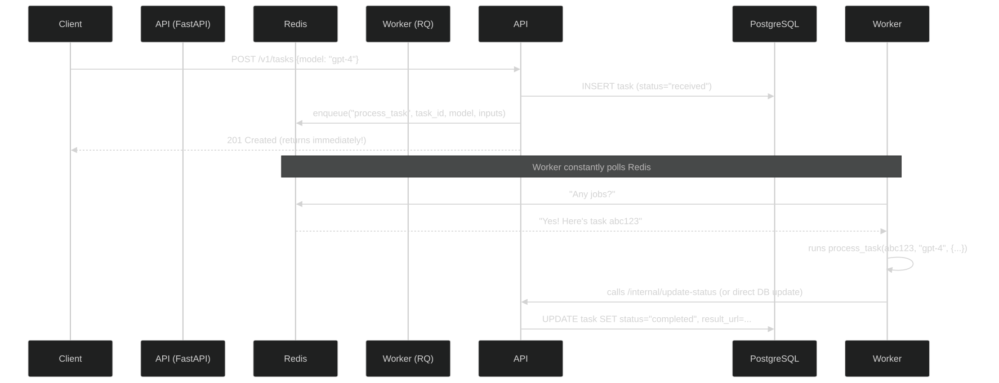

# Task Api

This project is to showcase building a end to end api for inference tasks based on what I think goes into building a api. A demostration of building a API using commonly used libraries like fastapi and so on. The theme is sending input to a AI model modelled as a "task".

## Tech Used

- fastapi
- docker
- uv
- postgres
- Redis + RQ
- minio
- Prometheus
- Grafana

## Request Diagram



## How To Run

```
docker compose build
docker compose up api
```

Example Requests

```
curl -i -X POST http://localhost:8000/v1/tasks \
-H "Content-Type: application/json" \
-H "X-API-KEY: DEV-KEY" \
-H "Idempotency-Key: 123" \
-d '{"model": "task_model_v1", "param": {"key1": "value1", "key2": "value2"}, "inputs": {"input1": "data1", "input2": "data2"}, "callback_url": "https://example.com/callback"}'


curl -H "X-API-KEY: DEV-KEY" http://localhost:8000/v1/tasks/<task_id>

```
